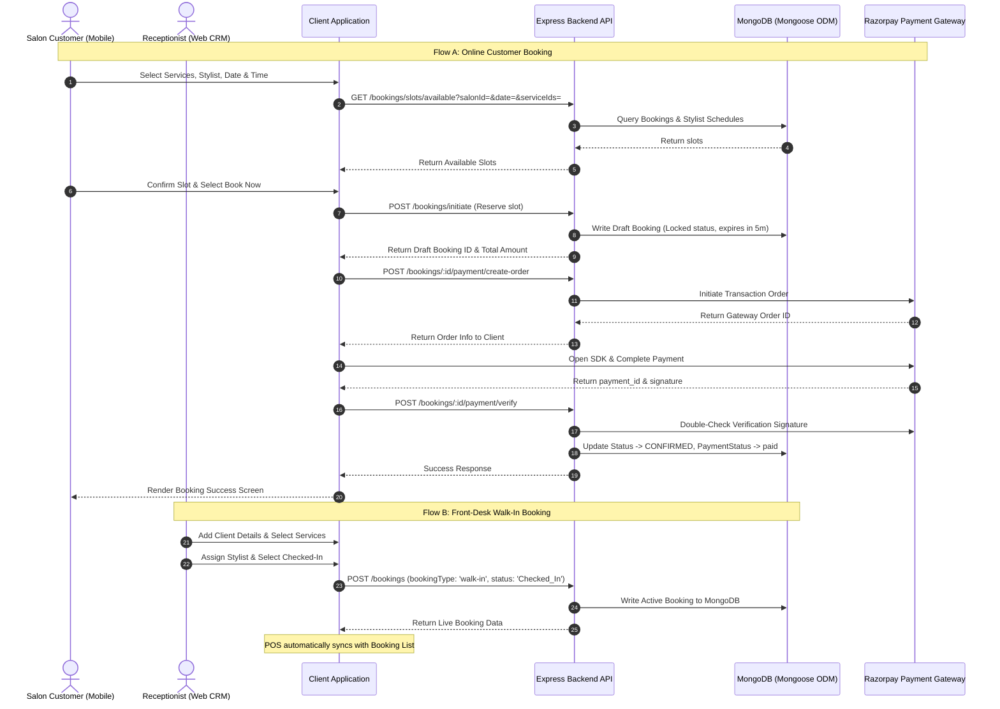

# Booking Flow - Tech Architecture & UI/UX Design

This document details the technical architecture, backend API sequences, state-management behaviors, and UI/UX design specifications for the complete booking ecosystem of the **Hair Ahmedabad** salon platform. It covers both customer-facing self-service booking (React Native Mobile App) and admin/receptionist-managed workflows (Next.js Web CRM & POS).

---

## ️ Technical Architecture & Data Flow

The booking flow operates on a decoupled client-server architecture. It features real-time slot checking, concurrency controls (slot locking), and secure payment validation pipelines.

### 1. Unified Booking Ecosystem Topography



---

### 2. Database Models & Schema Design
Bookings utilize a unified MongoDB model containing metadata to distinguish between online reservations and walk-in check-ins.

#### Key Models Structure:
* **Service Schema** (Contains pricing, category, and average duration):
 ```json
 {
 "_id": "ObjectId",
 "name": "Hair Cut",
 "price": 300,
 "duration": 30,
 "category": "Hair"
 }
 ```
* **Booking Schema** (Unified layout with status and payment states):
 ```json
 {
 "_id": "ObjectId",
 "customerName": "Ramesh Patel",
 "customerPhone": "9876543210",
 "services": [
 {
 "name": "Hair Cut",
 "price": 300,
 "duration": 30
 }
 ],
 "service": "Hair Cut",
 "staff": "ObjectId (ref: User)",
 "staffName": "Rahul Kumar",
 "date": "2026-06-12T00:00:00.000Z",
 "time": "14:30",
 "duration": 30,
 "price": 300,
 "status": "Checked_In", 
 "paymentStatus": "pending",
 "bookingType": "walk-in"
 }
 ```

---

### 3. API Endpoints Specs (Booking Specific)

* **GET `/api/bookings/slots/available`**
 * **Description**: Queries available booking slots based on date, requested service duration, and selected stylist schedule.
 * **Query Params**: `salonId`, `staffId`, `date` (YYYY-MM-DD), `serviceIds` (comma-separated).
* **POST `/api/bookings/initiate`**
 * **Description**: Creates a temporary holding draft for the selected time slot, preventing double booking during the payment gateway process.
 * **Payload**: `date`, `startTime`, `serviceIds`, `staffId`.
* **POST `/api/bookings/:id/payment/create-order`**
 * **Description**: Requests the backend to generate a Razorpay transactional order reference.
* **POST `/api/bookings/:id/payment/verify`**
 * **Description**: Receives payment signatures, verifies integrity, and updates the booking status to `CONFIRMED`.
* **POST `/api/bookings`**
 * **Description**: Instantly creates and confirms walk-in bookings directly from the salon reception desk.
 * **Payload**: `customerName`, `customerPhone`, `services`, `staff`, `date`, `time`, `bookingType: 'walk-in'`, `status: 'Checked_In'`.

---

### 4. Client State Control (Zustand & Sync)
* **Zustand `bookingStore`**:
 Manages local state transitions during multi-step reservation procedures. Keeps track of the selected date, cart items, selected stylist, and payment state variables.
* **Auto-Polling Mechanism**:
 The Web CRM Booking List page queries the database API every `5 seconds` to ensure real-time synchronization between bookings created on customers' mobile devices and walk-ins processed at physical checkout registers.

---

## UI/UX Design System for Booking Flow

The booking flow UI is crafted for visual clarity, simplicity, and low cognitive load. It guides users screen-by-screen while keeping salon staff updated in real time.

### 1. Customer Mobile Booking Journey (React Native)

```
┌─────────────────┐ ┌─────────────────┐ ┌─────────────────┐
│ Service Catalog │ ──> │ Select Stylist │ ──> │ Slot Selection │
│ (Multi-Select) │ │ (Reviews/Rating)│ │ (Time Grid) │
└─────────────────┘ └─────────────────┘ └─────────────────┘
 │
┌─────────────────┐ ┌─────────────────┐ │
│ Booking Success │ <── │ Secure Checkout │ <────────────┘
│ (Confetti/Ping)│ │ (Apply Coupon) │
└─────────────────┘ └─────────────────┘
```

* **Step 1: Service Catalog Screen**
 * **Design**: Curated horizontal swipe-tabs for categories (Hair, Nails, Facial, Waxing). Multi-select checklist tiles displaying prices and durations.
 * **UX**: Floating action bar showing `Cart: X Services (₹Y Amount)` with a "Choose Stylist" proceed trigger.
* **Step 2: Select Stylist Screen**
 * **Design**: Stylist profile cards featuring clean avatar bubbles, ratings (e.g. ` 4.8 (120 reviews)`), and badges highlighting areas of expertise.
 * **UX**: An optional "Any Stylist" button at the top to bypass manual selection and auto-assign an available team member.
* **Step 3: Slot Selection Screen**
 * **Design**: Horizontal scrolling date ribbon. Underneath, a clean grid of available start times grouped by time of day (Morning, Afternoon, Evening).
 * **UX**: Unavailable time slots are grayed out. Selected slots glow using the Plum Brand primary color (`--accent`).
* **Step 4: Secure Checkout Screen**
 * **Design**: Accordion panels displaying service breakdowns, selected stylist details, and checkout options. Prominent "Apply Promo Code" field.
 * **UX**: Live calculation adjustments when a coupon is successfully applied.
* **Step 5: Booking Success Screen**
 * **Design**: Centered status confirmation badge with animation effects, detailed ticket breakdown, and quick action shortcuts (Add to Calendar, Call Salon).

---

### 2. Walk-in POS Booking Journey (Next.js Web CRM)

* **Single-Screen Panel Layout**:
 * Designed to support quick walk-in check-ins under 30 seconds.
 * **Left Column**: Interactive services listing grid with search.
 * **Right Column**: Customer info form fields, stylist selection dropdown, checkout status selector, and transaction summary card.
* **Post-Paid Option**:
 * Walk-in flows bypass payment gateway checks. The booking is logged directly as `Checked_In` with `paymentStatus: 'pending'`, enabling quick check-ins upon salon arrival.

---

### 3. Visual Styling Tokens (CSS variables)

Design styles map dynamically to support Light & Dark modes:

```css
:root {
 /* Dynamic Accents */
 --accent: #9D679F; /* Soft Plum brand highlight color */
 --support-sage: #6F9F8F; /* Success states, Checked-In status indicators */
 --support-sky: #6D91BF; /* Info states, Scheduled status indicators */
 --support-gold: #C7923E; /* In-Service / Pending payment actions */
 
 /* Layout Canvas */
 --bg: #ffffff; /* Light background */
 --border: #ead8e5; /* Light border separator */
 --text-primary: #24151a; /* Dark charcoal text */
}

.dark {
 --bg: #171014; /* Deep dark plum background */
 --border: #3c2b36; /* Muted dark border */
 --text-primary: #fff7f7; /* High-contrast white/pink text */
}
```

#### Micro-Interactions & Styling Classes:
* **Status Halo Pulsing**:
 * Ongoing bookings labeled as `In_Service` show a pulsating green indicator using `.dashboard-revenue-dot-halo` animation parameters to signify active styling sessions.
* **Hover Scaling**:
 * Interactive service card buttons grow on pointer hover using smooth transition rules (`transition: all 0.2s ease-in-out` and `transform: scale(1.02)`).
* **Glassmorphism Detail Cards**:
 * Booking tickets are housed inside containers styled with backdrop blurs (`backdrop-blur-md bg-white/10 dark:bg-black/10`).
